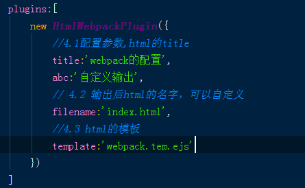
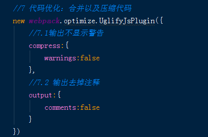
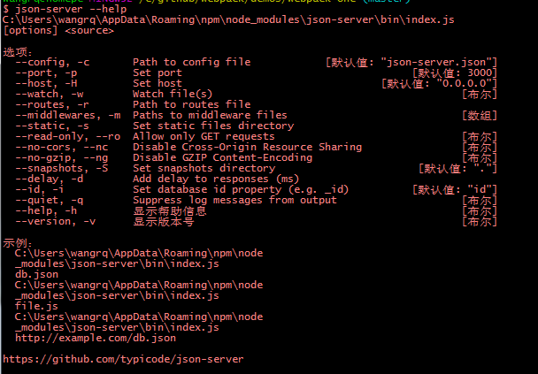
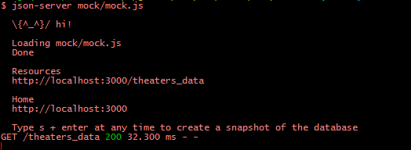
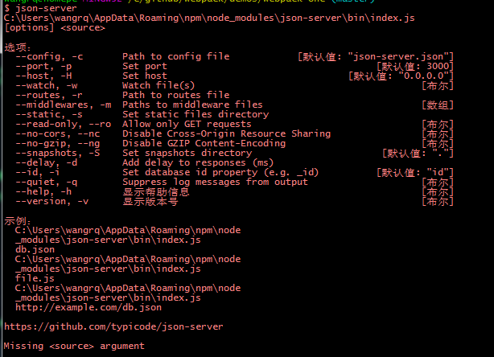
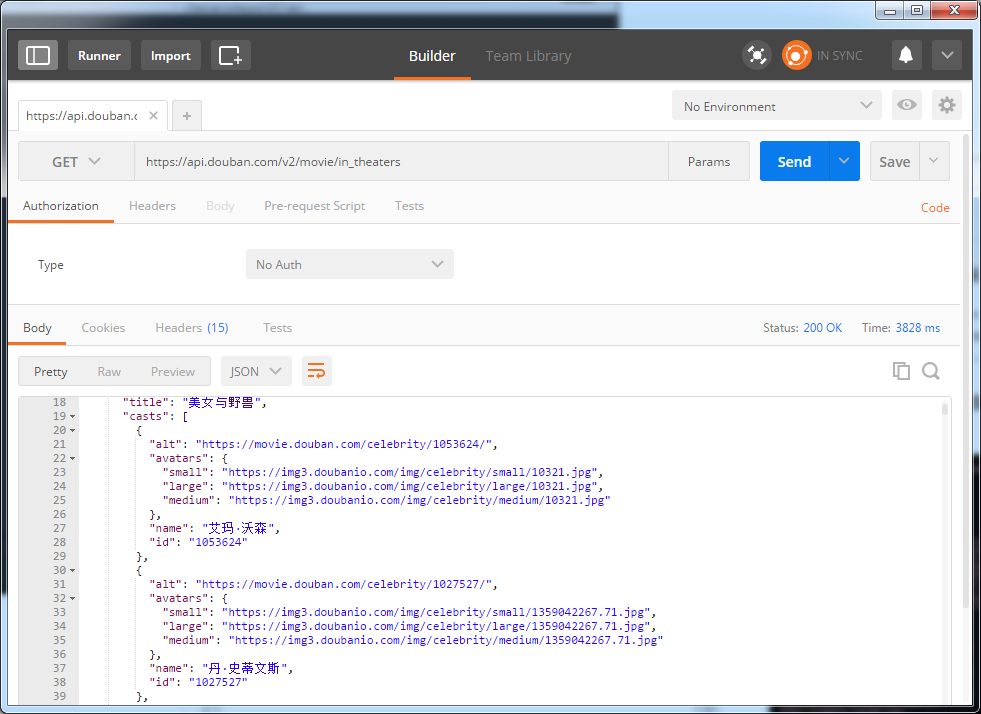

3/18/2017 2:56:43 PM 
# 如何使用命令行把文件夹用VS或者webstorm打开 #
+ vs安装的时候已经默认添加到环境变量了，直接在文件夹下输入：code .就会自动把该文件夹用visual Studio编辑器打开
+ webstorm的话，添加到环境变量就OK，如我的ws，我把：E:\tools\WS\WebStorm 2016.3.4\bin；添加到环境变量，然后在文件夹下输入：webstorm .就会自动把所在文件夹用ws打开了

## 目录
+ 1 启动server webpack-dev-server
+ 2 模块化开发commonjs
+ 3 版本号控制 hash  chunkhash
+ 4 css，sass引入
+ 5 html自定义模板
+ 6 抽离css
+ 7 压缩合并JS
+ 8 用babel编译es6,需要创建.babelrc文件

#### 一、 命令行操作创建文件夹和文件
+ mkdir flodName创建文件夹
+ touch index.js 创建 index.js
+ mv index.js app.js src/  把index.js app.js移动到src目录下
+ rm build.js 删除build.js
+ rm -rf build 删除文件夹
+ npm i xx --save-dev等于npm i xx -D

### 二、commonJS模块化的四个步骤
+ 1 创建模块，var ...
+ 2 module.exports=模块名字，暴露模块
+ 3 var name=require('模块名字');
+ 4 使用模块：如下
+ 
+ 
+ **切记：不要循环引用(如a依赖b,b依赖c,c依赖d...)**

### 三、具体配置

### 3.1 如何启动服务器
+ npm install webpack-dev-server -g 全局安装webpack服务器，webpack-dev-server启动服务器，如果报错(Error: `output.path` needs to be an absolute path or `/`.
)，说明输出路径必须是绝对路径
+ devserver有自动刷新功能
+ webpack-dev-server --hot --inline
+ 题外话，启动服务器后浏览器查看DOM会看到html标签下有shadow-root，具体了解请[参考图灵社区](http://www.ituring.com.cn/article/177453 "组件化")

### 3.2 如何给文件配置版本号，清除缓存
+ filename:'[name]_[chunkhash].js'
+ 只要源代码不变，版本号不会变得。
+ 可以清除缓存，出现BUG可以回滚原来版本

#### 4 HTML模板配置
+ 可以是xxx.html也可以是其他如xxx.ejs
+ 使用ejs可以在自定义输出
+ <%= htmlWebpackPlugin.options.somename %>
+ 
+ template.ejs 内如下：
+ 
+ 自动生成后html内部如：
+ 

#### 5 css，sass的引入
+ 需要分别npm i css-loader style-loader -D
+ css-loader负责把css编译为JS
+ style-loader负责把css嵌入到html内
+ 能不能把CSS抽离，单独放在一个文件，需要配置：extract-text-webpack-plugin插件(6-6.2)

#### 6 压缩合并以及代码
+ 直接调用webpack.optimize.UglifyJsPlugin()内置插件就可以了
+ 
+ 这样就会同时合并到一个JS文件内了(建议开发的时候不要压缩合并)

#### 7 编译es6，需要分辨安装如下依赖
+ npm install babel-core --save-dev
+ npm install babel-loader --save-dev
+ npm install babel-preset-es2015 --save-dev

### 8 json-server搭建虚拟服务器
+ npm install json-server -g
+ 
+ mock文件夹下是接口数据文件和mock.js(作为mock数据的配置)
+ .json是字符串，里面key和value必须有双引号
+ 现在可以用json-server搭建一个虚拟服务器，如命令行运行：json-server mock/mock.js 如下
+ 
+ json-server的参数配置如：
+ 
+ json-server mock/mock.js -p 9000
+ 
+ 默认监听的是mock.js

### 8.1 如何用fetch去发送Ajax请求
+ [fetch简介](https://segmentfault.com/a/1190000003810652)
+ 如：student.js/9.0

### 9 postman测试接口的chrome扩展程序
+ 翻墙之后在chrome扩展应用商店搜索postman并安装该扩展程序，会自动安装一个本地的postman程序，注册登录打开后可以测试后台的接口文档。如查看豆瓣：即将上映的电影api接口如下：
+ 
+ 可以搜索：豆瓣开发者(公开的接口文档)
+ 当然也可以直接浏览器输入接口地址，借助chrome的JSONView扩展程序去盘版接口文档，不然默认的很难看清楚